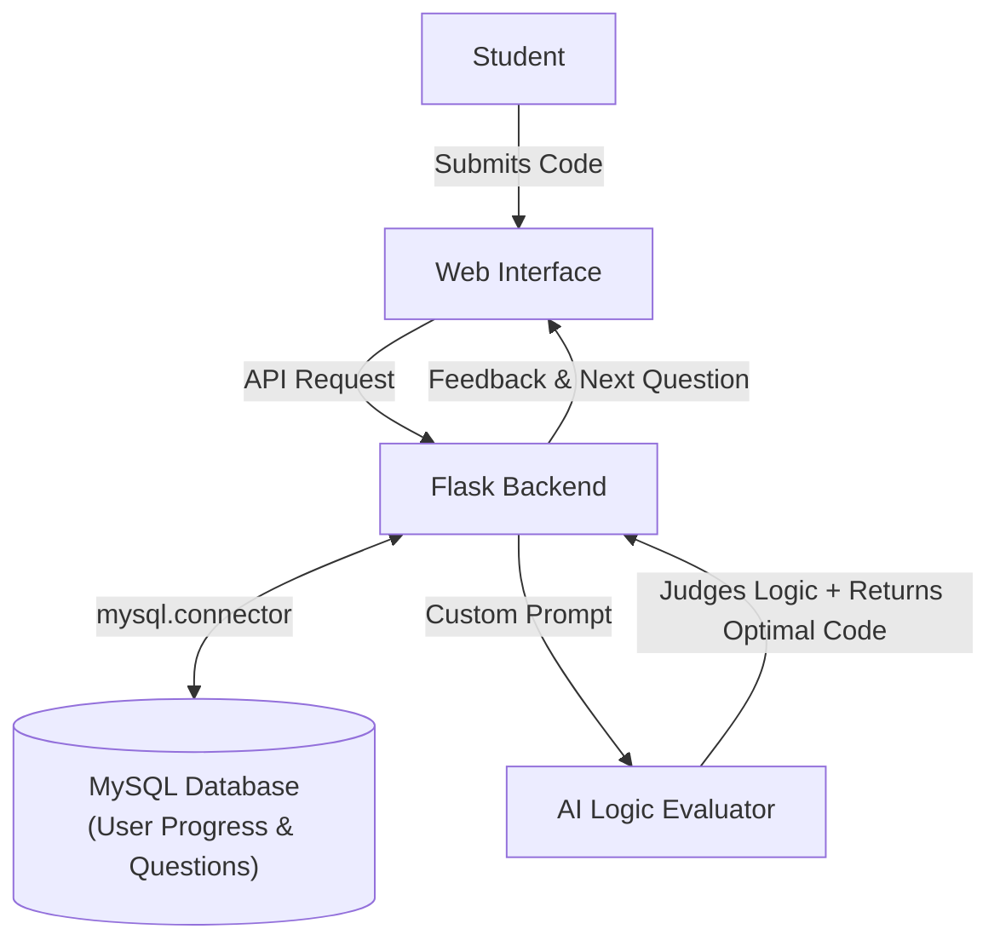

# LogicEval-AI: CBSE Class 12 Coding Logic Tutor

[](https://www.python.org/)
[](https://flask.palletsprojects.com/)
[](https://www.mysql.com/)
[](https://opensource.org/licenses/MIT)

An AI-assisted coding tutor built for CBSE Class 12 computer science that tests whether a student's code logic is sound, instead of expecting exact memorized code.

---

## Why I Built This

In high school computer science (specifically CBSE Class 12 Python), I noticed two common issues:

1. **Rote learning over logic**: Standard evaluation often expects students to write code almost line-by-line the way a textbook or answer key does. If a student solves the problem with a different approach, it's often flagged as wrong even if the logic is completely valid.
2. **Teacher workload**: For any single programming question, there can be dozens or hundreds of different ways to get the same output. Manually reading through and debugging every single student's unique script is exhausting for teachers.

I built this project to solve both problems:
* Students can write code using their own unique logic without worrying about rote memorization.
* The system checks whether the logic works as intended according to the CBSE syllabus.
* If correct, the student moves forward; either way, they get to see the most optimal CBSE-aligned solution with a breakdown to learn how to write cleaner code.

---

## What It Does

* **Tests Logic, Not Syntax Memorization**: Verifies if the approach solves the question accurately according to CBSE standards.
* **Shows the Optimal Solution**: Displays the most efficient way to solve the question along with an explanation.
* **Progress Tracking with SQL**: Student progress is tracked in a database so they can pick up where they left off.
* **Easily Expandable Question Bank**: New questions can be added at any time simply by inserting rows into the MySQL database without changing the code.

---

## How It Works



---

## Tech Stack

* **Backend**: Python, Flask, `mysql-connector-python`
* **Database**: MySQL
* **Frontend**: HTML, CSS, JavaScript
* **AI Integration**: OpenRouter / OpenAI API endpoint

---

## Project Attribution & How This Was Built

To be completely upfront about what I built versus what AI helped with:

### What I built myself:
* **The Core Concept**: Identifying the problem in CBSE evaluation (teacher grading fatigue and rote learning) and designing a logic-first checker.
* **Database Design & Relationships**: Creating the MySQL tables for questions and student progress, structuring how foreign keys and question pointers track user progression.
* **Python to MySQL Integration**: Writing the connection logic and queries using `mysql.connector` to fetch questions, check user state, and save progress.
* **Prompt Engineering**: Designing and tuning the exact prompt that forces the AI to judge the underlying logic (instead of expecting an exact answer key), bound strictly to the CBSE Class 12 syllabus, while returning the optimal solution without biasing the evaluation.

### What AI assisted with:
* The Flask web framework setup and API route scaffolding.
* The frontend UI (HTML layout, CSS styling, and the JavaScript handling the login/registration forms).
* Refactoring hardcoded credentials into a clean `.env` file for GitHub.

---

## Project Structure

```
LogicEval-AI/
├── app.py                      # Flask server, database queries, and AI prompt runner
├── templates/
│   └── index.html              # Frontend user interface
├── database/
│   ├── schema.sql              # Table structure (user progress and questions)
│   └── seed_questions.sql      # Starter set of CBSE Class 12 Python questions
├── .env.example                # Configuration template (passwords kept private)
├── .gitignore                  # Keeps local files and secrets off Git
├── requirements.txt            # Python dependencies
├── LICENSE                     # MIT License
└── README.md                   # Documentation
```

---

## Setup & Running Locally

### 1. Prerequisites
* Python 3.8+
* MySQL Server
* Git

### 2. Clone and install dependencies
```bash
git clone https://github.com/Raghav-019/LogicEval-AI.git
cd LogicEval-AI

# Create virtual environment
python -m venv venv
venv\Scripts\activate   # On Windows
# source venv/bin/activate  # On macOS/Linux

pip install -r requirements.txt
```

### 3. Database setup
Import the schema and starter questions into MySQL:
```bash
mysql -u root -p < database/schema.sql
mysql -u root -p < database/seed_questions.sql
```

### 4. Configure environment
Copy `.env.example` to `.env`:
```bash
cp .env.example .env
```
Fill in your MySQL credentials and your AI API key in `.env`.

### 5. Run the app
```bash
python app.py
```
Open your browser and visit `http://localhost:5000`.

---

## License

This project is licensed under the [MIT License](LICENSE).
